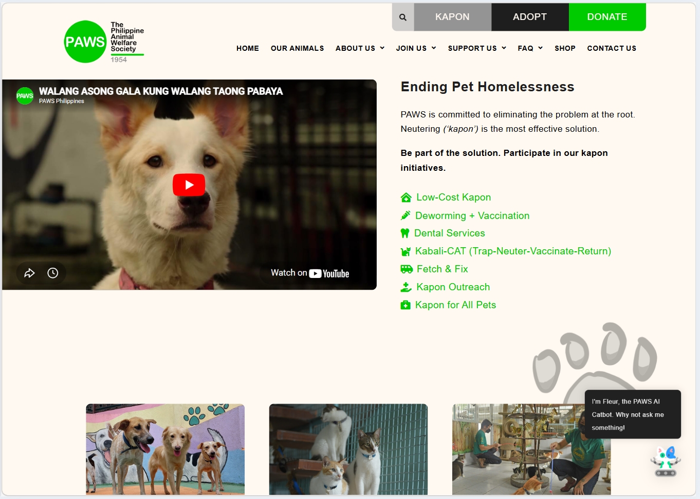
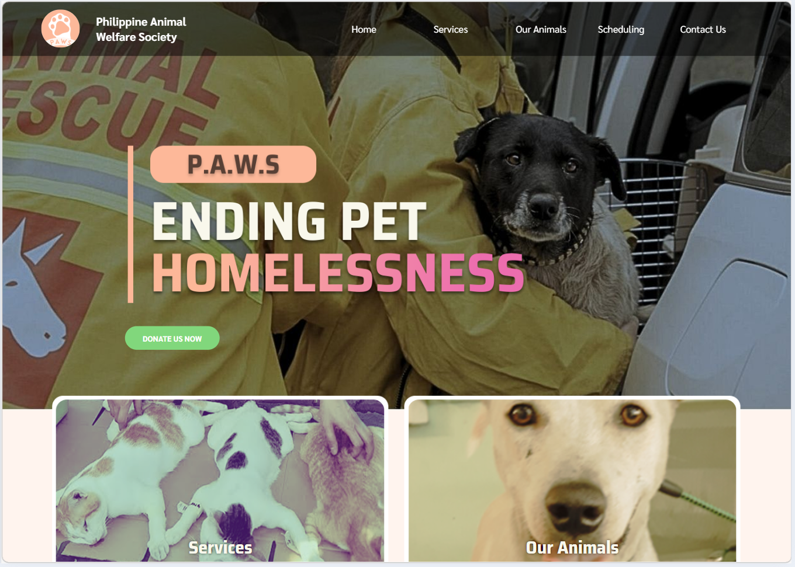
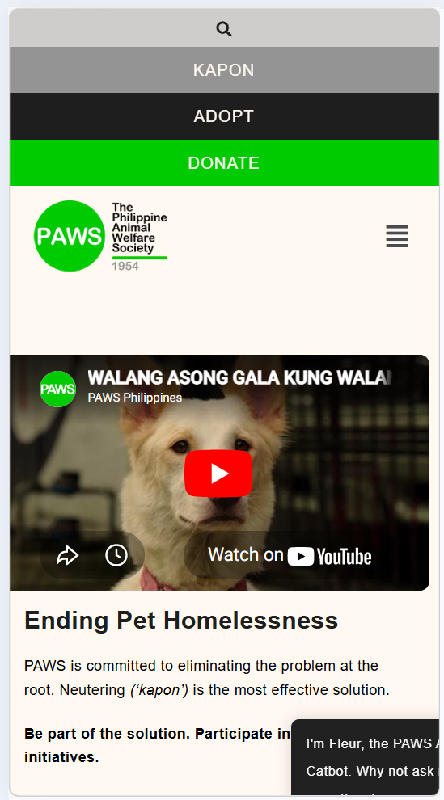
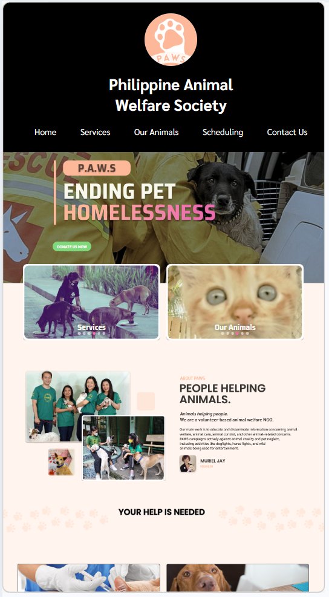

<br />
<div align="center">
  <a href="https://github.com/GreeceA/PAWS_Rebranding_EDP_Finals">
    
  </a>

  <h3 align="center">PAWS: UI/UX Rebranding & Front-End Architecture</h3>

  <p align="center">
    A complete visual and structural modernization of the Philippine Animal Welfare Society (PAWS) digital presence.
    <br />
    <a href="#"><strong>View Live Demo »</strong></a>
    <br />
    <br />
  </p>
</div>

<div align="center">
  
  
  
</div>

<br>

---

##  About the Project

Legacy interfaces often create friction for non-profit organizations, hindering their ability to connect with the community. This project is a comprehensive **UI/UX rebranding and front-end rebuild** for the Philippine Animal Welfare Society (PAWS). 

The primary objective was to engineer a fresh, accessible, and emotionally engaging user experience. By modernizing the layout and optimizing the user flow, this redesign significantly reduces friction for critical conversion points: **pet adoption, community donations, and welfare education**.

> **💡 Note:** This project demonstrates a strong command of vanilla web technologies, semantic markup, and responsive design principles without relying on heavy front-end frameworks.

---

## System Previews

To truly understand the value of this rebrand, here is a look at the original PAWS website compared to our modernized, user-centric architecture.

###  Homepage Redesign
*The old layout was cluttered and difficult to navigate. Our redesign introduces a clean, emotional hero section with clear calls to action (Donate, Adopt).*

| Before: Original PAWS Website | After: Our Modern Redesign |
| :---: | :---: |
|  |  |

###  Mobile Experience
*The original site relied on pinch-to-zoom. The new architecture is fully responsive with a custom JavaScript hamburger menu for seamless mobile browsing.*

| Before: Non-Responsive | After: Mobile-First Navigation |
| :---: | :---: |
|  |  |

###  Adoption & Donation Flow
*We removed friction from the most critical user journeys, turning text-heavy pages into interactive, streamlined galleries.*


---

##  Technical Highlights

* **Responsive Architecture:** Engineered fluid, multi-device layouts utilizing modern CSS Grid and Flexbox.
* **Accessible UI:** Built with semantic HTML5 to ensure content is readable by screen readers and accessible to all users.
* **Interactive DOM Manipulation:** Wrote clean, vanilla JavaScript to handle interactive components like FAQ accordions, sidebar navigation, and mobile menus.
* **Performance Optimization:** Implemented optimized asset delivery and efficient CSS styling for rapid page load times.
* **Maintainable Codebase:** Enforced strict, professional naming conventions (`kebab-case`) and modular file structures for scalable long-term maintenance.

---

##  Getting Started

To view this project locally on your machine:

### Prerequisites
* A modern web browser
* *(Optional)* Node.js for running a local server

### Installation

1. Clone the repository:
   ```bash
   git clone [https://github.com/GreeceA/PAWS_Rebranding_EDP_Finals.git](https://github.com/GreeceA/PAWS_Rebranding_EDP_Finals.git)

2. Navigate to the project directory:
   ```bash
   cd PAWS_Rebranding_EDP_Finals

3. **Open `home.html` (or any page) in your browser:**
	 - Double-click the file, or
	 - Use a local server (recommended for JS features):
		 ```bash
		 npx serve .
		 ```

   
